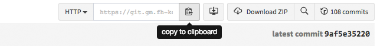
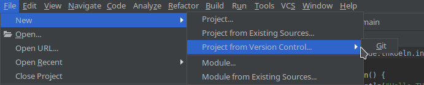
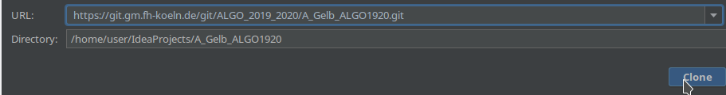
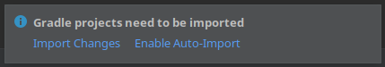

Algo Praktikum – A Gelb
---

**1.** Kopiere die URL dieser Repository in deine Zwischenablage. Den Reiter im Bild findest du [hier](tree/master#pull-request-area).  

---

**2.** Öffne nun IntelliJ und wähle die blau hervorgehobene Option um dieses Projekt zu importieren.

Git Projekt in IntelliJ importieren

URL eingeben und clonen: `https://git.gm.fh-koeln.de/git/ALGO_2019_2020/A_Gelb_ALGO1920.git`

Gradle Projekt importieren

Präsentation und Handout
---
[Präsentation](docs/Pra%CC%88sentation.pptx)
[Handout](docs/Handout.pdf)
