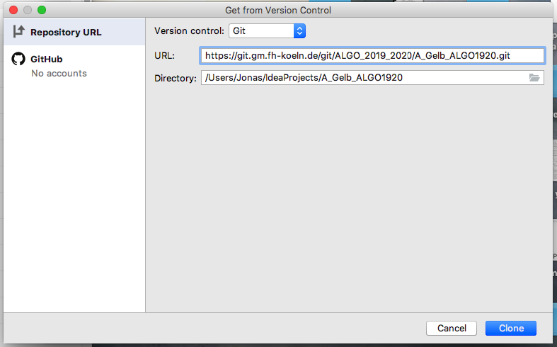

### Algorithmik-Praktikum – Projekt des Teams "A-Gelb"
---

**1.** Kopiere die URL dieser Repository in deine Zwischenablage. Den Reiter im Bild findest du [hier](#pull-request-area).  

---
**2.** Öffne nun IntelliJ und wähle die blau hervorgehobene Option um das Projekt zu importieren.

---
**3.** Füge die URL aus dem ersten Schritt in das entsprechende Feld ein.

---
__Links__: [Präsentation](docs/Pra%CC%88sentation.pptx), [Handout](docs/Handout.pdf)
