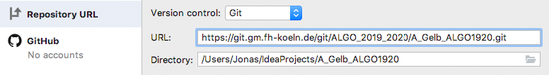

### Algorithmik-Praktikum – Projekt des Teams "A-Gelb"
---

**1.** Kopiere die URL dieser Repository in deine Zwischenablage. Den Reiter im Bild findest du [hier](#pull-request-area).  

‌‌ ‌‌ ‌‌ ‌‌ 

---
**2.** Öffne nun IntelliJ und wähle die blau hervorgehobene Option um das Projekt zu importieren.  

‌‌ ‌‌ ‌‌ ‌‌ 

---
**3.** Füge die URL aus dem ersten Schritt in das entsprechende Feld ein.

‌‌ ‌‌ ‌‌ ‌‌ 

---
**4.** Importiere das Gradle-Projekt.
  

‌‌ ‌‌ ‌‌ ‌‌ 

---
**5.** Öffne nun den Gradle-Tab. Dieser befindet sich in der rechten Leiste.  

‌‌ ‌‌ ‌‌ ‌‌   

‌‌ ‌‌ ‌‌ ‌‌ Hier findest du eine Liste von Aufgaben (*Tasks*). Für diesen Workshop sind nur **`application/run`** und **`verification/test`**  
‌‌ ‌‌ ‌‌ ‌‌ interessant. Mit **`run`** führst du das Hauptprogramm aus in welchem du interaktiv Graphen erstellen, laden und abspeichern  
‌‌ ‌‌ ‌‌ ‌‌ und die Algorithmen von Prim und Kruskal zur Bestimmung eines minimal spannenden Baums bzw. Teilgraphen schrittweise  
‌‌ ‌‌ ‌‌ ‌‌ ausführen kannst. **`test`** führt unsere Tests aus mit welchen überprüft wird ob du die Live-Aufgabe richtig gelöst hast.

---
__Links__: [Präsentation](docs/Pra%CC%88sentation.pptx), [Handout](docs/Handout.pdf)
